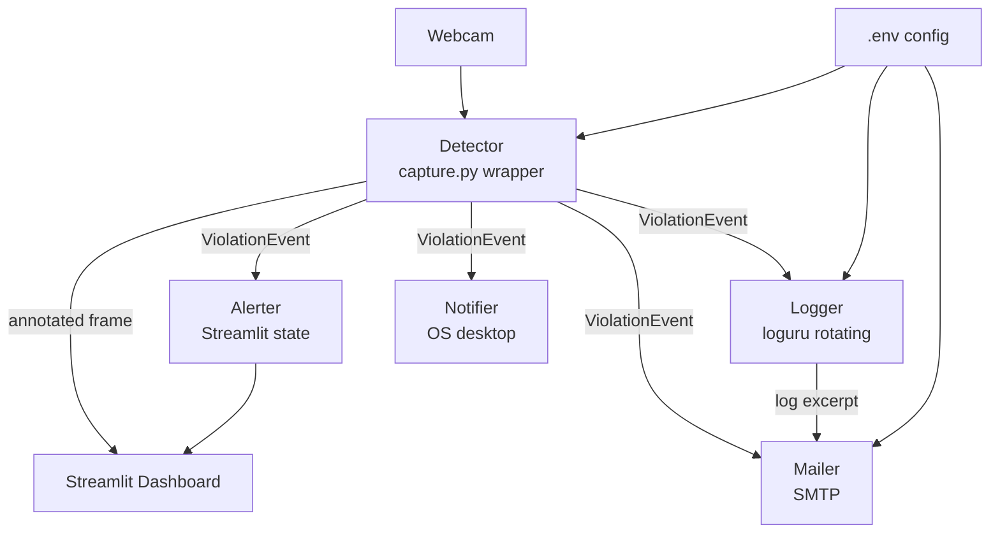
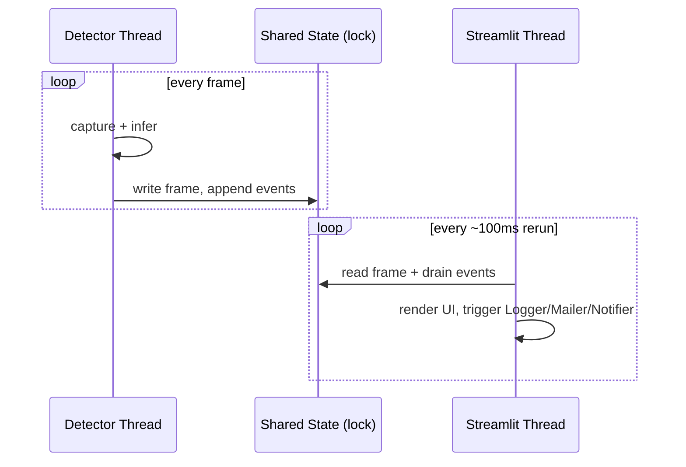

# Design Document: Safety Dashboard

## Overview

The Safety Dashboard is a Streamlit-based real-time monitoring interface for construction site safety. It wraps the existing `capture.py` detection pipeline into a modular, event-driven architecture with five distinct responsibilities: live video display, violation logging, on-screen alerting, email reporting, and OS desktop notifications.

The system is structured around a central `Detector` component that produces `ViolationEvent` objects. All downstream components (Logger, Alerter, Mailer, Notifier) consume these events independently, keeping concerns cleanly separated.



---

## Architecture

### Component Boundaries

| Component | File | Responsibility |
|-----------|------|----------------|
| Detector | `Scripts/detector.py` | Webcam capture, YOLOv8 inference, scenario analysis, frame annotation |
| Logger | `Scripts/logger.py` | Hourly rotating log files via loguru |
| Alerter | `Scripts/alerter.py` | Alert state machine (normal → escalated), acknowledgement |
| Mailer | `Scripts/mailer.py` | SMTP email with screenshot attachment and log excerpt |
| Notifier | `Scripts/notifier.py` | Cross-platform OS desktop notifications |
| Dashboard | `Scripts/dashboard.py` | Streamlit UI, wires all components together |
| Config | `Scripts/config.py` | Loads and validates `.env` settings at startup |

### Threading Model

Streamlit reruns the script on each UI cycle. The Detector runs in a **background thread** (daemon), writing the latest annotated frame and any new `ViolationEvent` objects into thread-safe shared state. The Streamlit main thread reads this state on each rerun.



---

## Components and Interfaces

### Config (`config.py`)

Loads all settings from `.env` at import time. Raises `SystemExit` with a descriptive message if any required variable is absent.

```python
@dataclass
class AppConfig:
    webcam_index: int          # WEBCAM_INDEX
    model_path: str            # MODEL_PATH
    confidence: float          # CONFIDENCE_THRESHOLD
    smtp_host: str             # SMTP_HOST
    smtp_port: int             # SMTP_PORT
    smtp_user: str             # SMTP_USER
    smtp_password: str         # SMTP_PASSWORD
    supervisor_email: str      # SUPERVISOR_EMAIL
    log_dir: str               # LOG_DIR

def load_config() -> AppConfig: ...
```

### Detector (`detector.py`)

Wraps `capture.py` logic. Runs in a background thread. Exposes a thread-safe interface.

```python
@dataclass
class ViolationEvent:
    violation_type: str        # e.g. "NO-Hardhat", "Person Near Vehicle"
    confidence: float          # 0.0–1.0 (1.0 for scenario violations)
    timestamp: datetime
    frame_snapshot: np.ndarray # annotated frame at time of violation

class Detector:
    def start(self) -> None: ...
    def stop(self) -> None: ...
    def get_latest_frame(self) -> Optional[np.ndarray]: ...
    def drain_events(self) -> List[ViolationEvent]: ...
```

Scenario detection logic runs after per-frame YOLO inference:
- **Person Near Vehicle**: IoU or centroid distance ≤ 50px between a `Person` box and a `vehicle` box.
- **Vehicle Over Safety Cone**: IoU > 0 between a `vehicle` box and a `Safety Cone` box.
- **Vehicles Approaching**: Two `vehicle` boxes present in consecutive frames with centroids moving closer.

### Logger (`logger.py`)

Uses loguru with a `rotation="1 hour"` sink. File naming pattern: `safetye_{time:YYYY-MM-DD_HH}.log`.

```python
class SafetyLogger:
    def __init__(self, log_dir: str): ...
    def log_violation(self, event: ViolationEvent) -> None: ...
    def get_recent_excerpt(self, n_lines: int = 20) -> str: ...
```

### Alerter (`alerter.py`)

Pure state machine — no Streamlit imports. Manages alert lifecycle.

```python
@dataclass
class AlertState:
    violation_type: str
    detected_at: datetime
    escalated: bool
    acknowledged: bool

class Alerter:
    def add_violation(self, event: ViolationEvent) -> None: ...
    def acknowledge(self, violation_type: str) -> None: ...
    def tick(self, escalation_seconds: int = 5) -> None: ...
    def active_alerts(self) -> List[AlertState]: ...
```

### Mailer (`mailer.py`)

Sends SMTP email with PNG attachment and log excerpt. Retries up to 3 times with 10-second intervals in a background thread so it never blocks the UI.

```python
class Mailer:
    def __init__(self, config: AppConfig, logger: SafetyLogger): ...
    def send_violation_report(self, event: ViolationEvent) -> None: ...
    # internally: _send_with_retry(event, attempt=0)
```

Screenshot filename: `violation_YYYY-MM-DD_HH-MM-SS.png`

### Notifier (`notifier.py`)

Cross-platform desktop notifications. Falls back gracefully.

```python
class Notifier:
    def notify(self, event: ViolationEvent) -> None: ...
    # Windows: win10toast or winotify
    # macOS/Linux: plyer
```

### Dashboard (`dashboard.py`)

Entry point: `streamlit run Scripts/dashboard.py`

Responsibilities:
1. Call `load_config()` — exits on misconfiguration.
2. Initialise all components in `st.session_state` on first run.
3. Start `Detector` background thread.
4. On each rerun: read frame → display → drain events → update Alerter → render alerts → trigger Mailer/Notifier for new events.
5. Render acknowledge buttons for active alerts.

---

## Data Models

### ViolationEvent

```python
@dataclass
class ViolationEvent:
    violation_type: str        # canonical violation name
    confidence: float
    timestamp: datetime        # UTC, ISO 8601 formatted for display
    frame_snapshot: np.ndarray # 640×480 BGR annotated frame
```

### AlertState

```python
@dataclass
class AlertState:
    violation_type: str
    detected_at: datetime
    escalated: bool = False
    acknowledged: bool = False
```

### AppConfig

See Config section above.

### Log Entry Format

```
2024-07-15 14:32:05 | VIOLATION | NO-Hardhat | conf=0.87
2024-07-15 14:32:10 | VIOLATION | Person Near Vehicle | conf=1.00
```

---

## Correctness Properties

*A property is a characteristic or behavior that should hold true across all valid executions of a system — essentially, a formal statement about what the system should do. Properties serve as the bridge between human-readable specifications and machine-verifiable correctness guarantees.*

### Property 1: Violation events contain required fields

*For any* `ViolationEvent` produced by the Detector, the event must have a non-empty `violation_type`, a `confidence` in [0.0, 1.0], a valid `timestamp`, and a non-None `frame_snapshot` of shape (480, 640, 3).

**Validates: Requirements 1.4, 6.4**

---

### Property 2: Whitespace-only violation types are rejected

*For any* string composed entirely of whitespace characters, the Alerter must reject it and leave the active alert list unchanged.

**Validates: Requirements 3.1**

---

### Property 3: Alert escalation after timeout

*For any* `AlertState` that has been active for at least 5 seconds without acknowledgement, calling `tick()` must set `escalated = True`.

**Validates: Requirements 3.4**

---

### Property 4: Acknowledgement clears alert

*For any* active `AlertState`, calling `acknowledge()` with the matching `violation_type` must result in that alert no longer appearing in `active_alerts()`.

**Validates: Requirements 3.3**

---

### Property 5: Log entry round-trip

*For any* `ViolationEvent`, after calling `log_violation(event)`, the `get_recent_excerpt()` output must contain the `violation_type` and a substring matching the event's timestamp (to the minute).

**Validates: Requirements 2.2**

---

### Property 6: Config validation rejects missing variables

*For any* `.env` configuration with one or more required variables removed, `load_config()` must raise a `SystemExit` (or equivalent) and the error message must name the missing variable.

**Validates: Requirements 7.2**

---

### Property 7: Person-near-vehicle detection is symmetric in proximity

*For any* pair of bounding boxes (one Person, one vehicle) whose centroids are within 50 pixels of each other, the Detector must raise a "Person Near Vehicle" violation regardless of which box appears first in the detection list.

**Validates: Requirements 6.1**

---

### Property 8: Vehicle-over-cone detection requires overlap

*For any* pair of bounding boxes (one vehicle, one Safety Cone) with zero IoU, the Detector must NOT raise a "Vehicle Over Safety Cone" violation.

**Validates: Requirements 6.2**

---

### Property 9: Email attachment filename matches timestamp

*For any* `ViolationEvent`, the PNG attachment filename produced by the Mailer must match the pattern `violation_YYYY-MM-DD_HH-MM-SS.png` using the event's timestamp.

**Validates: Requirements 4.6**

---

### Property 10: Mailer retry count is bounded

*For any* SMTP failure scenario, the Mailer must attempt delivery at most 4 times total (1 initial + 3 retries) before logging failure and stopping.

**Validates: Requirements 4.4, 4.5**

---

## Error Handling

| Failure | Behaviour |
|---------|-----------|
| Webcam unavailable at startup | Detector sets `feed_available = False`; Dashboard shows "Feed Unavailable" |
| Webcam disconnects mid-run | Detector catches `cap.read()` failure, sets flag; Dashboard shows "Feed Unavailable" |
| Log write fails | Logger retries once; on second failure writes to `sys.stderr` |
| SMTP send fails | Mailer retries 3× at 10s intervals in background thread; logs failure on exhaustion |
| Desktop notification unavailable | Notifier catches exception, logs warning, continues |
| Missing `.env` variable | `load_config()` logs descriptive error and calls `sys.exit(1)` |
| Invalid confidence value in `.env` | `load_config()` raises `ValueError` with field name |

---

## Testing Strategy

### Dual Testing Approach

Both unit tests and property-based tests are required. Unit tests cover concrete examples and integration points; property tests verify universal correctness across randomised inputs.

### Unit Tests (`tests/test_*.py`)

- `test_config.py`: valid `.env` loads correctly; each missing variable triggers exit with correct message.
- `test_alerter.py`: alert added → appears in active list; acknowledge → removed; 5s elapsed → escalated.
- `test_detector.py`: `draw_hazards` draws only hazard classes; scenario functions return correct violation types for known box configurations.
- `test_mailer.py`: attachment filename format; retry logic calls SMTP the right number of times (mock SMTP).
- `test_logger.py`: log entry contains violation type and timestamp; file rotation creates new file on hour boundary.

### Property-Based Tests (`tests/test_properties.py`)

Uses **Hypothesis** (Python PBT library). Each test runs a minimum of **100 iterations**.

Tag format in comments: `Feature: safety-dashboard, Property N: <property_text>`

| Test | Property | Hypothesis Strategy |
|------|----------|---------------------|
| `test_violation_event_fields` | Property 1 | `st.builds(ViolationEvent, ...)` with valid ranges |
| `test_whitespace_violation_rejected` | Property 2 | `st.text(alphabet=st.characters(whitelist_categories=('Zs',)))` |
| `test_alert_escalates_after_timeout` | Property 3 | `st.floats(min_value=5.0, max_value=3600.0)` for elapsed time |
| `test_acknowledge_clears_alert` | Property 4 | `st.lists(st.text())` for violation types |
| `test_log_entry_round_trip` | Property 5 | `st.builds(ViolationEvent, ...)` |
| `test_config_rejects_missing_vars` | Property 6 | `st.sets(st.sampled_from(REQUIRED_VARS))` for vars to remove |
| `test_person_vehicle_proximity_symmetric` | Property 7 | `st.tuples(bbox_strategy, bbox_strategy)` within 50px |
| `test_vehicle_cone_no_overlap_no_violation` | Property 8 | non-overlapping bbox pairs |
| `test_email_filename_format` | Property 9 | `st.datetimes()` |
| `test_mailer_retry_bounded` | Property 10 | `st.integers(min_value=1, max_value=4)` for failure count |

Each property test must include a comment:
```python
# Feature: safety-dashboard, Property N: <property text>
```
